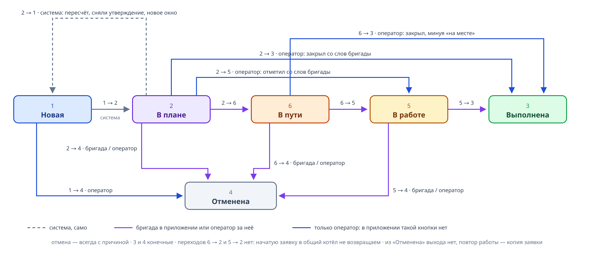

# Обозначения:
T — момент синхронизации, системное время
[t0; t1] — окно заявки
статусы — цифры: 1 Новая, 2 В плане, 3 Выполнена, 4 Отменена, 5 В работе, 6 В пути
приоритеты — P1 аварийный, P2 высокий, P3 обычный
ярусы второго расчета — латинские буквы A-F

## Статусы заявки

| № | Статус | Что значит |
|---|---|---|
| 1 | Новая | ни в одном плане, ждет расчета |
| 2 | В плане | стоит в маршруте утвержденного плана |
| 3 | Выполнена | конечный |
| 4 | Отменена | конечный, выхода нет |
| 6 | В пути | бригада выехала |
| 5 | В работе | бригада на месте |

## Все переходы

Списком:

- `1 -> 2` система: утвердили план
- `2 -> 1` система: сняли утверждение, пересчет или новое окно заявки
- `2 -> 6` выехала · бригада в приложении или оператор за нее
- `6 -> 5` на месте · бригада или оператор
- `5 -> 3` выполнила · бригада или оператор
- `2 -> 4`, `6 -> 4`, `5 -> 4` отмена с причиной · бригада («Не выполнить») или оператор
- `1 -> 4` отмена с причиной · только оператор
- `2 -> 5`, `2 -> 3`, `6 -> 3` только оператор: в приложении таких кнопок нет, они срезают шаги
- из `4` переходов нет: отмена окончательна, повтор работы — копия заявки
- переходов `6 -> 2` и `5 -> 2` нет: начатую заявку в общий котел не возвращают

Оператор может проставить любой ручной переход, в том числе за бригаду. У бригады в приложении
только свой маршрут: «Выехали», «На месте», «Выполнено» и «Не выполнить».

## Алгоритм при задержки бригады и расхождении в плане

Пусть во время T существовали заявки 1 2 3 4 в предыдущем плане, причем 1 2 должны были выполнится
а бригада застряла на 1ой.

Пересчет идет на время T+15min причем состояние системы будет таким, как будто ожидается, что все идут по плану.
Если за это время придет новая заявка или кто-то затрянет другой, то придется выполнить все пункты заново, об этом нужно уведомить.

**0)**  2ая заявка является причиной пересчитать весь план, при синхронизации мы это поняли

**1) Пересчитываем как есть (первый расчет)**

Закрытые (статус 3,4) и начатые (статус 6, 5) не трогаем, они остаются за бригадой
Остальные алгоритм снимает с плана (`2 -> 1`) и считаем заново по всем бригадам с настоящими окнами
Бригада свободна с того места, где она сейчас, но не раньше T; если застряла и оператор уточнил
по телефону — с указанного им времени «освободится в HH:MM»
Ярусы целевой функции, сверху вниз (каждый важнее всех нижних):

- **A0** — P1, аварийные
- **B0** — отметка «согласовано»: обещание клиенту, подвинуть его может только авария
- **C0** — P2 с отметкой «перенесена»
- **D0** — P3 с отметкой «перенесена»
- **E0** — P2
- **F0** — P3
- **G0** — дальше: максимум заявок, меньше бригад, меньше пробега

Любая перенесенная идет выше неперенесенных, чтобы заявки не кочевали изо дня в день
Отметки живут на заявке, поэтому перенесенные и согласованные с прошлых дней уже учтены

Y = заявки, которые решатель не взял. Просроченные (t1 < T) и те, к кому никто не успевает
доехать, попадают сюда сами, отдельно их выкидывать не надо
Если Y пустое — сразу к шагу 5

**2) Всем из Y раскрываем окно в пол:** `[max(t0;T) ; самый поздний конец смены среди бригад дня]`

В базе окна не меняем, раскрытие живет только внутри расчета
Конец смены каждой бригады остается жестким ограничением, поэтому широкая верхняя граница
ничего не ломает: заявку возьмет только та бригада, которая реально успеет
Не нужно фиксировать и пытаться на фиксированый маршрут вставить заявку, нужно считать новое распределение заявок по бригадам (естественно с учетом текущего состояния)

**3) Считаем второй раз (второй расчет)**

Ярусы только для этого расчета:

- **A1** — P1, аварийные, откуда бы ни были: авария вправе подвинуть обычную заявку
- **B1** — все, кто влез в первый расчет; внутри по ярусам B0-F0:
  «согласовано» → P2 «перенесена» → P3 «перенесена» → P2 → P3
- **C1** — раскрытые; внутри так же, по ярусам B0-F0
- **D1** — дальше как обычно: максимум заявок, меньше бригад, меньше пробега

G0 не класс заявок, а общий хвост, он применяется один раз в конце — здесь это D1

Ярус B1 — защита от вытеснения: раскрытая заявка не должна выкинуть ту, что уже влезла,
иначе появится новая жертва и новый звонок
Выкидывать заявки из групп B1 запрещено, перераспределить согласно текущему времени можно
Ярусы разделены с запасом, чтобы размен «одна влезшая на две раскрытых» не стал выгодным
Жестких ограничений «обязано быть в плане» нет, задача не становится неразрешимой
На выходе по каждой заявке из Y конкретное: «Соколов приедет в 17:40» либо «сегодня никак»

**4) Оператор обзванивает и решает по каждой заявке из Y**

Все заявки из Y сейчас в статусе 1: их сняли с плана на шаге 1, поэтому окно менять можно

| Ответ клиента | Статус | Окно | Отметка |
|---|---|---|---|
| согласен на предложенное окно | 1 | 17:40-18:10 (время из расчета + допуск 30 мин) | «согласовано на 17:40-18:10» |
| сегодня не может | 1 | завтрашнее, обычной ширины | «перенесена с 17.08» |
| работа не нужна | `1 -> 4`, причина «клиент отказался» | не меняем | нет |
| не дозвонились | `1 -> 4`, причина «не дозвонились» | не меняем | «требует уточнения» |

Решение нужно по каждой заявке из Y: либо согласованное окно, либо завтра, либо отмена.
Висящих без решения не оставляем
Не дозвонились — тоже отмена, но с отметкой «требует уточнения»: такие заявки видно отдельно,
оператор перезванивает позже и, если работа нужна, заводит копию
Приоритет заявки (P1, P2, P3) оператор не трогает — он остается таким, каким пришел от типа работ
Статус на этом шаге меняется только при отмене; в 2 заявки перейдут на шаге 6, при утверждении
Работают отметки: они дают заявке свой ярус в расчете, под капотом

**5) Третий расчет, уже с настоящими окнами**

Согласованные держатся своими узкими окнами, отказавшиеся освободили место

Ярусы те же, что в шаге 3:

- **A2** — P1, аварийные, откуда бы ни были: авария вправе подвинуть обычную заявку
- **B2** — все, кто влез в первый расчет; внутри по ярусам B0-F0:
  «согласовано» → P2 «перенесена» → P3 «перенесена» → P2 → P3
- **C2** — раскрытые; внутри так же, по ярусам B0-F0
- **D2** — дальше как обычно: максимум заявок, меньше бригад, меньше пробега

Сверяем обещания: если заявка с отметкой «согласовано» не попала в план или стоит вне
обещанного окна — предупреждаем до утверждения, решает оператор (вернуть прежний план
или утвердить и перезвонить клиенту)

**6) Утверждаем**

Пересчет считается на выезд через запас (15 минут на сам расчет и обзвон) и рассчитывает, что
эти минуты все едут по прежнему плану. В этот момент он вступает в силу сам — кнопку жать не
обязательно (можно и раньше, руками). Если к этому моменту появились новые вводные — пришла или
отменилась заявка, бригада выбилась из плана или уехала не туда, куда ведет расчет, — план в
силу не вступает: он помечается недействительным с причиной, у действующего плана горит «!»,
бригады продолжают ехать по нему, и день считают заново, уже с новыми вводными

Первый расчет дня живет по тем же правилам: он тоже считается на выезд через запас, и
утвердить его можно только до этого момента и только пока день не изменился. Позже — считаем
день заново. Расчет после подбора окон это тот же круг: он встает веткой под своим черновиком
и получает свой момент выезда, а прежний черновик к своему моменту протухает

Шаги 2-5 одинаковы у черновика дня и у пересчета. Сам расчет (шаг 1) окна не подбирает: кому
не нашлось места, тот остается невлезшим, и по нему решают отдельно — «Подобрать окна» это
второй расчет, «Утвердить» это перенос на другой день или отмена. Так за одно нажатие идет
ровно один расчет, а не три подряд

План заменяет действующий, его заявки `1 -> 2`
Пока пересчет не утвержден, действует старый план, а снятые заявки висят «Новыми» — показываем
это явно
Расчетов на круг ровно три: первый, второй и финальный
Прежний план не удаляется: он помечается замененным, и по цепочке планов дня
(№19 до 12:07 → №22 до 18:42 → №41 действует) видно, по какому плану ездили в какое время
Утверждение с плана, по которому уже работают, не снимают: маршрут пропал бы у едущей бригады.
Менять его можно только пересчетом. Снять можно, пока день не настал и никто не отметился

## Выезды бригад

Работает все время, не только при пересчете

**7) Когда считаем, что бригада выбилась из плана**

Любое из двух, допуск 10 минут — параметр системы:

- не нажала «Выехали» через 10 минут после планового времени выезда
- с текущим отставанием к окну следующей заявки уже не успеть

**8) Что делает система**

Блокирует «Выехали»: в приложении «Ждите нового плана»
Пока есть неутвержденный пересчет, выезд открыт только на ту заявку, которую новый план дает
этой же бригаде ближайшей: бригада едет туда же, куда ее ведет расчет, и утверждение такой
выезд принимает. На остальные заявки выезд закрыт, иначе бригада закрепит за собой заявку
вопреки расчету
У оператора строка «Бригада Паршин ждет плана с 12:05, отстает на 40 мин, не успевает к №15»
и телефон бригады

**9) Что делает оператор — звонит и выбирает одно из двух**

- «разрешить выезд»: клиент согласился подождать, бригада едет как есть
- пересчитать: тогда сначала уточняет по телефону, когда бригада освободится (пункт 10),
  и запускает алгоритм с шага 1

**10) «Освободится в HH:MM»**

Если бригада застряла на заявке, плановая длительность уже не годится: новый план считается
от времени, которое оператор узнал по телефону
Если бригада уже в пути и опаздывает — блокировать нечего: либо доедет с опозданием, либо
оператор звонит клиенту и отменяет заявку (`6 -> 4` с причиной)

**11) Бригада узнает об изменениях в приложении**

Заявку отменили или сняли с плана, пока бригада работала — при обновлении маршрута
(раз в полминуты) она видит уведомление: «Заявка №15 отменена диспетчером»
В карточке отмененной заявки — подробности: кто отменил (диспетчер или сама бригада),
когда и причина; у снятой с плана — «снята при пересчете, бригада к ней не едет»
Так бригада не поедет зря и не будет звонить, чтобы выяснить, что случилось

Считаем, что бригада всегда на связи и отвечает, таймауты и «пропавшие» бригады не городим

## Правила, которые нигде не нарушаем

- Начатое и закрытое не двигаем и автоматически не отменяем
- Окно меняем только когда заявка снята с плана, и только как след разговора с клиентом
- Раскрытие окон в расчете нигде не сохраняется
- Отмена окончательна, повтор работы — копия заявки
- Приоритет заявки оператор не меняет: перенос и согласование работают отметками и ярусами
- Утверждается ровно тот расчет, который видел оператор
- Обещание клиенту может быть сорвано только с ведома оператора
- Бригада узнает об отмене и снятии заявки из приложения, с причиной: молча маршрут не меняется
- План, по которому работают, меняется только пересчетом; прежние планы дня остаются в истории

## Что для этого надо добавить в систему

- Телефон бригады — в справочник бригад, в карточку маршрута и в диалог пересчета
- Причину при отмене оператором — сейчас причина есть только у бригады в приложении
- Отметку «перенесена с ...» и ее ярус в расчете, с записью в историю заявки
- Второй расчет с раскрытыми окнами и ярусами A-F
- Отметку «согласовано на ...» и сверку обещаний после финального расчета
- Поле «освободится в HH:MM» по бригаде в диалоге пересчета
- Запрет выезда с причиной в мобильном приложении и проверку на бэкенде
- Строку «ждет плана» и кнопку «разрешить выезд» у оператора
- Уведомление бригаде об отмене и снятии заявки, подробности отмены в карточке визита

## Порядок работ

1. Отметки «перенесена» и «согласовано», причина при отмене, записи в историю
2. Второй расчет и предложения времени для звонка
3. Отметка «согласовано» и сверка обещаний
4. Телефон бригады
5. Запрет выезда, «ждет плана», «разрешить выезд»
6. Уведомления бригаде и подробности отмены в приложении
7. «Освободится в»
